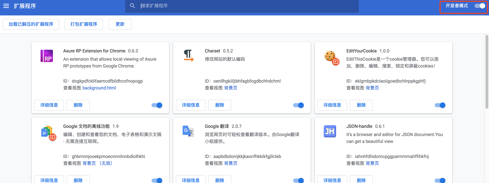
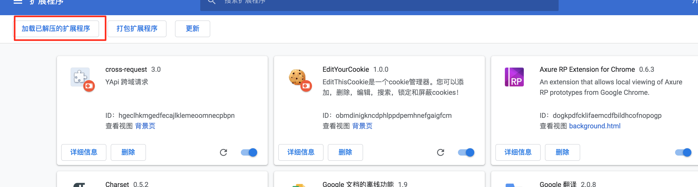

# 使用 Docker 部署 YAPI

**1、运行 MongoDB**

```kotlin
# 创建存储卷
docker volume create mongo-data

# 启动 MongoDB
docker run -d \
  --name mongo-yapi \
  -v mongo-data:/data/db \
  -e MONGO_INITDB_ROOT_USERNAME=anoyi \
  -e MONGO_INITDB_ROOT_PASSWORD=anoyi.com \
  mongo
```

**2、获取 YAPI 镜像，其他版本：[阿里云镜像仓库](https://links.jianshu.com/go?to=https%3A%2F%2Fdev.aliyun.com%2Fdetail.html%3Fspm%3D5176.1972343.2.26.I97LV8%26repoId%3D139034)**

```sh
docker pull registry.cn-hangzhou.aliyuncs.com/anoyi/yapi
```

**3、自定义配置文件 `config.json`**

```json
{
  "port": "3000",
  "adminAccount": "admin@anoyi.com",
  "timeout":120000,
  "db": {
    "servername": "mongo",
    "DATABASE": "yapi",
    "port": 27017,
    "user": "anoyi",
    "pass": "anoyi.com",
    "authSource": "admin"
  }
}
```


**4、初始化 YAPI 数据库索引及管理员账号**

```bash
docker run -it --rm \
  --link mongo-yapi:mongo \
  --entrypoint npm \
  --workdir /yapi/vendors \
  -v $PWD/config.json:/yapi/config.json \
  registry.cn-hangzhou.aliyuncs.com/anoyi/yapi \
  run install-server
```

**5、启动 Yapi 服务**

```bash
docker run -d \
  --name yapi \
  --link mongo-yapi:mongo \
  --workdir /yapi/vendors \
  -p 3000:3000 \
  -v $PWD/config.json:/yapi/config.json \
  registry.cn-hangzhou.aliyuncs.com/anoyi/yapi \
  server/app.js
```

###  使用 YAPI

- 访问： [http://localhost:3000](https://links.jianshu.com/go?to=http%3A%2F%2Flocalhost%3A3000)
- 登录账号：`admin@anoyi.com`
- 密码：`ymfe.org`

## chrome 安装 yapi 扩展

因不明原因，yapi 的扩展被 chrome 官方下架了，大家只能使用本地安装的方式了。

## 安装方法

#### 1. 下载扩展 zip

[下载链接](https://github.com/YMFE/cross-request/archive/master.zip) 首先手动下载 zip 文件，然后解压

#### 2. 打开 chrome://extensions

> **必须开启开发者模式**



#### 3. 然后点击加载已解压的扩展程序



### FAQ

1. 为什么我安装不成功

- 检测是否在 chrome://extensions 开启了开发者模式

## Yapi chrome插件cross-request无法安装

`YApi` 是一个可本地部署的、打通前后端及QA的、可视化的接口管理平台。

```
https://github.com/YMFE/yapi
```

很多同学在升级 chrome 后发现 yapi chrome 插件 cross-request 安装失败。安装之后无法启用。

FQ后chrome web store 也下架了这个插件。

我觉得是安全问题，为什么swagger不需要插件即可运行呢，因为它都是本域的请求，不涉及到跨域问题，这个插件主要就是解决跨域请求问题。

### 正常安装

其实很简单，使用开发者模式，并且是源码的模式，而非打包的 .crx 文件即可正常安装使用。

去哪儿把 YApi 都开源了，这个一个插件能不开源吗，直接找到 cross-request 的开源地址。

- 下载插件源码

```sh
git clone https://github.com/YMFE/cross-request
```

- 打开插件管理 `chrome://extensions/`
- 打开开发者模式
- 点击左边的`加载已解压扩展程序`，选择cross-request文件夹位置即可

