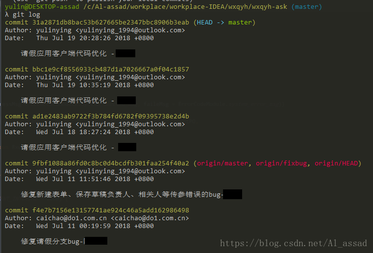
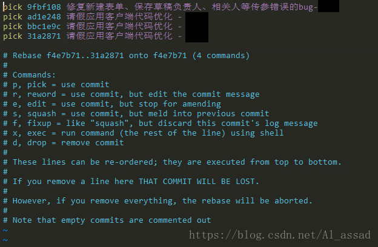
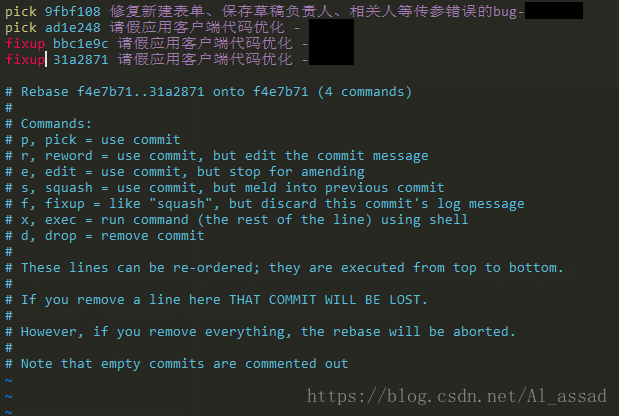
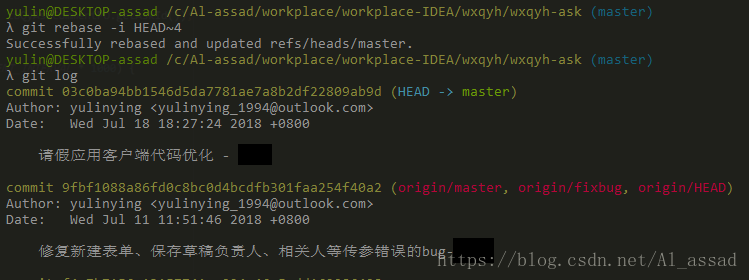
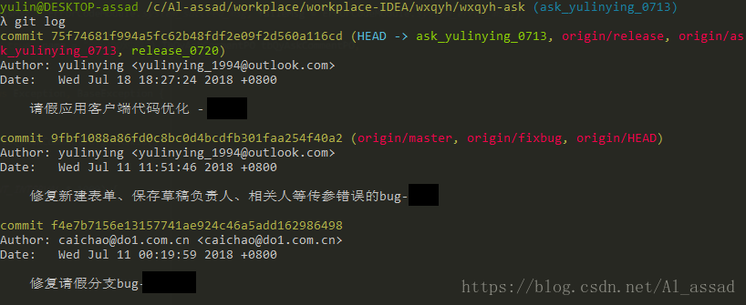
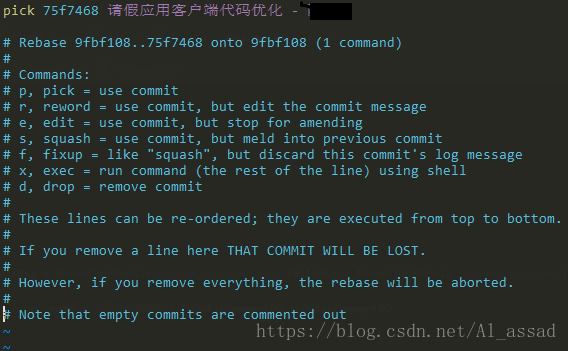
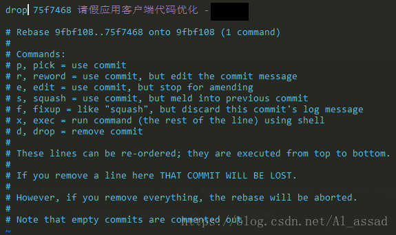

# Git 合并多次 commit 、 删除某次 commit

## Git 合并多次 commit

 

有时候在一个分支的多次意义相近的 commit，会把整个提交历史搞得很混乱，此时可以将一部分的 commit 合并为一个 commit，以美化整个 commit 历史，可以使用 rebase 的方法来合并多次 commit，主要步骤如下：

### 1. git log 查看当前的提交历史

比如需要将以下 3 个 ”请假应用客户端代码优化“ 的 commit 合并为一个 commit； 

### 2. git rebase 进行 git 压缩

执行 git rebase -i HEAD~4 对最近的 4 个 commit 进行 rebase 操作；

 

具体的操作下面的 Commands 说明得很清楚了，对于 commit 合并可以使用 squash、fixup 指令，区别是 squash 会将该 commit 的注释添加到上一个 commit 注释中，fixup 是放弃当前 commit 的注释；

 

编辑后保存退出，git 会自动压缩提交历史，如果有冲突，记得解决冲突后，使用 git rebase --continue 重新回到当前的 git 压缩过程；

### 3. 推送到远程仓库 git push -f

重新查看提交提交历史，会发现这些 commit 已经合并了，整个提交历史简洁了很多： 

## 删除某次 commit 

同样的，利用 git 压缩 rebase 指令来删除某个 commit，过程和以上是类似的；

在 git log 下，假如我们需要删除“请假应用客户端代码优化”这个 commit：

 

可以通过 git rebase -i HEAD~1 （对最近1次 commit 进行 rebase） 或 git rebase -i 9fbf10（对 commit id 前几位为 9fbf10 的 commit 之后的 commit 进行 rebase）;

 

 将需要删除的 commit 设置操作指令 drop ，保存退出即可；

 在执行 git log 时，可以发现该条 commit 已经从提交历史中删除了；