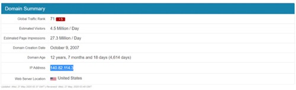

#Git 常见问题解决

## 解决Github上clone项目太慢

### 1. 搜索

在 [www.ipaddress.com/](https://www.ipaddress.com/) 上分别搜索

- github.global.ssl.fastly.net
- github.com

这两个域名对应的ip

### 

### 2. 更改hosts文件

Linux的hosts文件路径在：sudo vim /etc/hosts

在文件中添加

199.232.69.194 github.global-ssl.fastly.net

140.82.114.3 github.com

### 3.保存更新DNS

Centos7 清缓存命令 `nscd -i hosts`

**有可能nscd没装，下面讲解一下，安装，启动，清缓存的命令**

**1. 安装 nscd**

```sh
yum -y install nscd
```

**2. 查看状态 及 启动命令**

```sh
systemctl status nscd          # 查看状态
systemctl start nscd            # 启动 nscd
```

## Git冲突

> commit your changes or stash them before you can merge

用git pull来更新代码的时候，遇到了下面的问题：

```sh
error: Your local changes to the following files would be overwritten by merge:
    xxx/xxx/xxx.php
Please, commit your changes or stash them before you can merge.
Aborting
```

出现这个问题的原因是其他人修改了xxx.php并提交到版本库中去了，而你本地也修改了xxx.php，这时候你进行git pull操作就好出现冲突了，解决方法，在上面的提示中也说的很明确了。

### 1、保留本地的修改 的改法

1）直接commit本地的修改

2）通过git stash

```sh
git stash
git pull
git stash pop
```

通过git stash将工作区恢复到上次提交的内容，同时备份本地所做的修改，之后就可以正常git pull了，git pull完成后，执行git stash pop将之前本地做的修改应用到当前工作区。

git stash: 备份当前的工作区的内容，从最近的一次提交中读取相关内容，让工作区保证和上次提交的内容一致。同时，将当前的工作区内容保存到Git栈中。

git stash pop: 从Git栈中读取最近一次保存的内容，恢复工作区的相关内容。由于可能存在多个Stash的内容，所以用栈来管理，pop会从最近的一个stash中读取内容并恢复。

git stash list: 显示Git栈内的所有备份，可以利用这个列表来决定从那个地方恢复。

git stash clear: 清空Git栈。此时使用gitg等图形化工具会发现，原来stash的哪些节点都消失了。

2、放弃本地修改 的改法

```sh
git reset --hard
git pull
```

### 