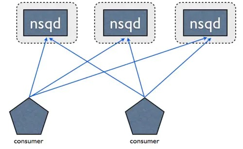
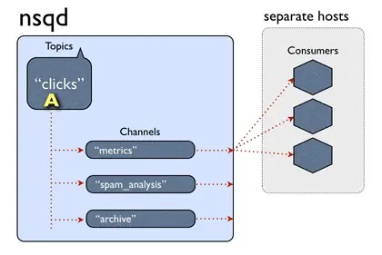

# NSQ笔记

Mac安装

 ```sh
brew install nsq
 ```

> nsqlookupd是守护进程负责管理拓扑信息。客户端通过查询 nsqlookupd 来发现指定话题（topic）的生产者，并且 nsqd 节点广播话题（topic）和通道（channel）信息，使用tcp(默认端口4160)管理nsqd服务，使用http(默认端口4161)管理nsqadmin服务。同时为客户端提供查询功能

###### 总的来说，nsqlookupd具有以下功能或特性：

- 唯一性，在一个Nsq服务中只有一个nsqlookupd服务。当然也可以在集群中部署多个nsqlookupd，但它们之间是没有关联的
- 去中心化，即使nsqlookupd崩溃，也会不影响正在运行的nsqd服务
- 充当nsqd和naqadmin信息交互的中间件
- 提供一个http查询服务，给客户端定时更新nsqd的地址目录

###### 启动nsqlookupd

```sh
nsqlookupd
```

###### nsqadmin 用来汇集集群的实时统计，并执行不同的管理任务

###### 总的来说，nsqadmin具有以下功能或特性：

- 提供一个对topic和channel统一管理的操作界面以及各种实时监控数据的展示
- 展示所有message的数量
- 能够在后台创建topic和channel
- nsqadmin的所有功能都必须依赖于nsqlookupd，nsqadmin只是向nsqlookupd传递用户操作并展示来自nsqlookupd的数据

###### 启动nsqadmin web UI:http://127.0.0.1:4171/

```sh
nsqadmin --lookupd-http-address=127.0.0.1:4161
```

> Topic(左上角)：发布的主题名字
>
> NSQd Host：Nsq主机服务地址
>
> Channel：消息通道
>
> NSQd Host：Nsq主机服务地址
>
> Depth：消息积压量
>
> In-flight：已经投递但是还未消费掉的消息
>
> Deferred：没有消费掉的延时消息
>
> Messages：服务器启动之后，总共接收到的消息量
>
> Connections：通道里面客户端的订阅数
>
> TimeOut：超时时间内没有被响应的消息数
>
> Memory + Disk：储存在内存和硬盘中总共的消息数


###### nsqd 一个守护进程，负责接收，排队，投递消息给客户端。主要负责message的收发，队列的维护。nsqd会默认监听一个tcp端口(4150)和一个http端口(4151)以及一个可选的https端口

###### 启动nsqd-node1 当nsqd进程退出时，将内存中的数据写入到磁盘；当nsqd进程启动时，将磁盘中的数据读入到内存



###### 总的来说，nsqd 具有以下功能或特性：

- 对订阅了同一个topic，同一个channel的消费者使用负载均衡策略（不是轮询）
- 只要channel存在，即使没有该channel的消费者，也会将生产者的message缓存到队列中（注意消息的过期处理）
- 保证队列中的message至少会被消费一次，即使nsqd退出，也会将队列中的消息暂存磁盘上(结束进程等意外情况除外)
- 限定内存占用，能够配置nsqd中每个channel队列在内存中缓存的message数量，一旦超出，message将被缓存到磁盘中
- topic，channel一旦建立，将会一直存在，要及时在管理台或者用代码清除无效的topic和channel，避免资源的浪费


###### 启动nsqd-node1

```bash
mkdir nsq1 && cd nsqd1
nsqd --lookupd-tcp-address=127.0.0.1:4160 -broadcast-address=0.0.0.0 -node-id 123 -tcp-address=0.0.0.0:4150 -http-address=0.0.0.0:4151
```

###### 启动nsqd-node2

```bash
mkdir nsqd2 && cd nsqd2 
nsqd --lookupd-tcp-address=127.0.0.1:4160 -broadcast-address=0.0.0.0 -node-id 456 -tcp-address=0.0.0.0:5150 -http-address=0.0.0.0:5151
```

###### 测试发送

```rust
curl -d "hello world!" 'http://127.0.0.1:4151/pub?topic=demo'
```

消费者有两种方式与nsqd建立连接



- 消费者直连nsqd
- 消费者通过http查询nsqlookupd获取该nsqlookupd上所有nsqd的连接地址，然后再分别和这些nsqd建立连接

